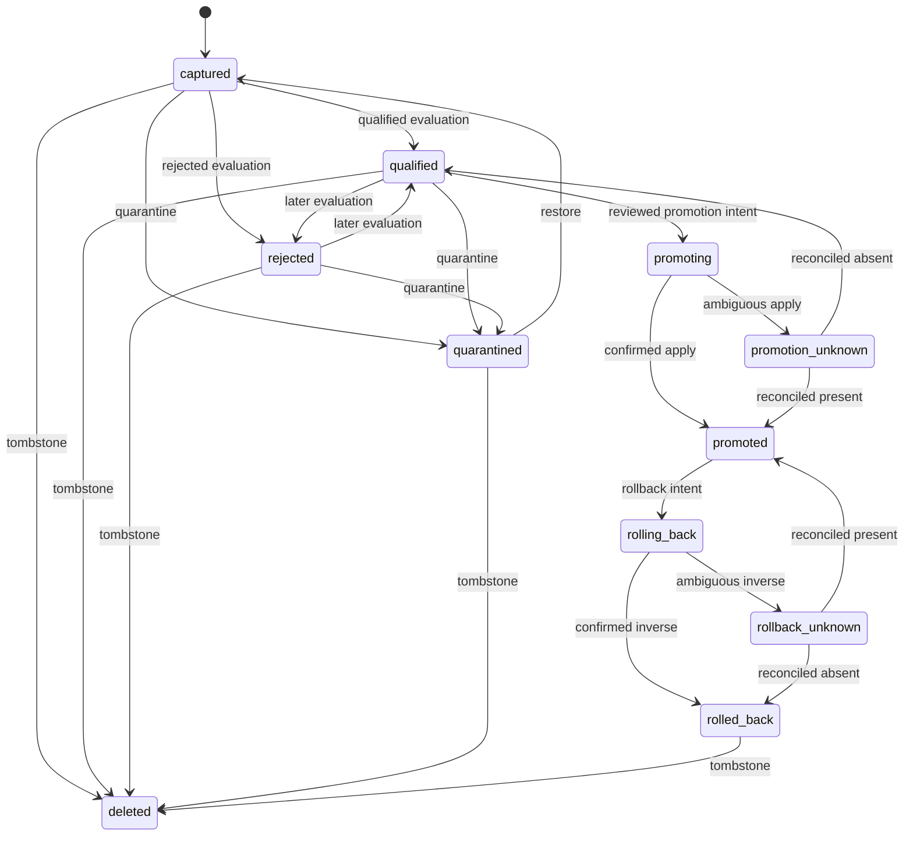

# Governed learning candidates

Status: v0.12 development preview

Last updated: 2026-08-17

This is agnoclaw's boundary between an agent proposing a learning and the application
trusting it. A candidate is inert, immutable, scoped data. It is never inserted into
model context merely because a model reflected on a run.

Use this path for Entity Memory, Learned Knowledge, Decision Log, and every shared or
behavior-changing proposal. Personal/session stores may still write directly when their
`LearningPolicy` explicitly permits it.

## Smallest complete setup

The current preview includes first-party SQLite and bounded-pool PostgreSQL candidate
ledgers. The example uses SQLite plus the local artifact store. Supply the same durable
runtime store used by `start()` so claimed source runs can be reauthorized before
capture.

```python
from agno.knowledge import Knowledge
from agnoclaw import (
    AgentHarness,
    LocalArtifactStore,
    LearningProfile,
    SQLiteLearningLedger,
    SQLiteRuntimeStore,
)

policy = LearningProfile.institutional(
    namespace="support-operations",
    knowledge=Knowledge(vector_db=vector_db),
    promotion="reviewed",
)

harness = AgentHarness(
    model=model,
    learning=policy,
    runtime_store=SQLiteRuntimeStore(".agnoclaw/runtime.db"),
    artifact_store=LocalArtifactStore(".agnoclaw/artifacts"),
    learning_ledger=SQLiteLearningLedger(".agnoclaw/learning.db"),
)
```

These are host-managed resources. Passing them into a harness does not transfer their
close/lifecycle ownership.

For a service deployment, replace only the ledger:

```python
from agnoclaw import PostgresLearningLedger

learning_ledger = PostgresLearningLedger(
    postgres_dsn,
    min_pool_size=1,
    max_pool_size=10,
    max_waiting=100,
)
```

The PostgreSQL implementation uses transactional row locks plus revision CAS, an
advisory migration lock, exact null-safe tenant matching, and bounded pool waiters. Pool
saturation returns retryable `LEARNING_LEDGER_OVERLOADED` rather than growing unbounded
connections.

Both ledgers use schema v6. The v3 candidate/event tranche atomically writes the record,
canonical content-free event, and outbox row for every revision; v4 adds the independent
owner-scoped reconciliation-worker lease/fence/cursor table; and v5 adds the typed,
content-free evaluation-archive projection, validated reason-code relation, and bounded
owner/filter/order indexes. Schema v6 adds append-only application-attribution and
outcome tables without incrementing the promotion row revision, so high-volume feedback
does not contend with promotion/rollback CAS. The canonical candidate, evaluation,
application, and outcome JSON remains the immutable source of truth. Exporters call
`learning_ledger.lease_outbox(...)` and acknowledge with the exact item/token; expired
leases can be reclaimed, delivered items cannot. PostgreSQL claims use the database
clock and `FOR UPDATE SKIP LOCKED`.

No promotion adapter is needed for the supported default: agnoclaw builds a scoped Agno
adapter for uniquely named Learned Knowledge. A custom `learning_promotion_adapter=` may
replace it. The adapter is a host boundary and is never exposed as a model tool.

## Capture

Capture is explicit application work, normally performed by an outcome processor after
a run has settled. It is not automatically inferred from chain-of-thought or a final
answer.

```python
from agnoclaw import CandidateAuthor, CandidateRisk, LearningTarget

candidate = await harness.capture_learning_candidate(
    context=trusted_context,
    target=LearningTarget.LEARNED_KNOWLEDGE,
    content={
        "title": "Retry discipline",
        "learning": "Retry only idempotent reads, with a bounded attempt count.",
        "tags": ["reliability"],
    },
    source_run_ids=[completed_run.run_id],
    evidence_artifact_ids=["artifact-verifier-output"],
    confidence=0.87,
    risk=CandidateRisk.MEDIUM,
    created_by=CandidateAuthor.AGENT,
    mechanism_version="reflector:v1",
    candidate_id="lc_retry_discipline_v1",  # enables exact idempotent replay
)
```

The harness resolves an opaque tenant/agent namespace from `trusted_context`, verifies
every source run with its exact tenant and user owner, stages content in `ArtifactStore`,
and then commits only the artifact reference plus provenance to `LearningLedger`.
Candidate content is not stored in the SQLite record.

Reuse of `candidate_id` is idempotent only for the same immutable candidate digest. A
different payload fails with `LEARNING_CANDIDATE_CONFLICT`.

An edit creates a new candidate and sets `supersedes_candidate_id`; it never rewrites the
old record. The ledger verifies that the predecessor is visible in the same scope and
has the same target.

Harness-component proposals additionally require both
`component_manifest_artifact_id` and `change_hypothesis_artifact_id`. The immutable
evaluator, policy, identity, model configuration, budgets, verifiers, benchmark cases,
and raw evidence remain outside that editable surface.

## Evaluate

Evaluation is a separate host/operator action with immutable evidence and a digest of
the evaluator contract:

```python
from agnoclaw import EvaluationVerdict, PromotionActor

qualified = await harness.evaluate_learning_candidate(
    candidate.candidate.candidate_id,
    context=trusted_context,
    verdict=EvaluationVerdict.QUALIFIED,
    evaluator_digest="sha256:" + evaluator_sha256,
    evidence_artifact_ids=["artifact-held-in", "artifact-held-out"],
    safety_passed=True,
    evaluated_by=PromotionActor.OPERATOR,
    mutation_id="evaluation:lc_retry_discipline_v1:v1",
    metrics={"held_in": 0.91, "held_out": 0.88},
    control_metrics={"held_in": 0.73, "held_out": 0.74},
)
```

A qualified verdict requires evidence and a passing safety gate. Rejected and
inconclusive evaluations remain in the archive; they are not discarded as failed
experiments. Harness-component experiments can use the preview
`ImprovementEvaluationGate` to enforce paired held-in/held-out/transfer datasets and
verifiers, frozen controls and budgets, judge audit, novelty/diversity, and a
five-objective Pareto frontier, then submit its immutable `CandidateEvaluation` through
`record_learning_candidate_evaluation()`. The preview first-party runner now verifies
exact scoped artifacts, executes fresh-resource pairs, stages per-case evidence, and
adds confidence-aware quality gates. Runner schema 1.2 can execute each side in a fresh
local process with a bound redacted contract and deterministic cleanup. The strict
Docker subject adds immutable exact-platform images, no network/host environment/mounts,
read-only non-root execution, zero capabilities, built-in seccomp, resource bounds, and
exact-owner cleanup. VM/provider-egress profiles, benchmark-corpus registry/ACL and
semantic-near-duplicate enforcement, richer statistical policy, and multi-provider
model-backed benefit evidence remain open. One exact local Agno Learned Knowledge
versus no-learning mechanism smoke now passes; it is documented separately because it
does not close the broad corpus/provider gate. See
[Evidence-gated harness self-improvement](self-improvement-evaluation.md).

### Query retained evaluation results

The host can query the owner-scoped, content-free evaluation read model without
exporting candidate content or scanning raw evidence artifacts:

```python
from agnoclaw import EvaluationArchiveQuery

page = await harness.query_learning_evaluation_archive(
    context=trusted_context,
    query=EvaluationArchiveQuery(
        reason_code="safety_gate_failed",
        mechanism_version="reflector:v1",
        safety_passed=False,
        limit=100,
    ),
)
for item in page.items:
    print(item.evaluation_id, item.verdict, item.failure_reason_codes)

if page.next_cursor is not None:
    next_page = await harness.query_learning_evaluation_archive(
        context=trusted_context,
        query=EvaluationArchiveQuery(
            reason_code="safety_gate_failed",
            limit=100,
            cursor=page.next_cursor,
        ),
    )
```

The default verdict set is `REJECTED` plus `INCONCLUSIVE`; include `QUALIFIED`
explicitly when required. Filters also support evaluator digest, candidate target, and
safety result. Pagination uses descending `(evaluated_at, evaluation_id)` keysets, and
the cursor is digest-bound to the exact learning owner. A cursor from
another tenant/namespace fails with `LEARNING_EVALUATION_ARCHIVE_CURSOR_SCOPE`.
Persist `page.next_cursor.to_dict()` with a long-running worker checkpoint and restore
it after restart with `EvaluationArchiveCursor.from_dict()`.

Entries expose only stable identifiers, verdict/actor/safety, candidate state/target/
mechanism, validated gate reason codes and control-plane digests, and an evidence count.
Candidate content, notes, raw metrics/control metrics, artifact IDs, and artifact
addresses are deliberately absent. This is a read-only host API, not a model-facing
tool and not promotion authority. Custom ledgers may implement the optional
`EvaluationArchiveLedger` protocol; otherwise the gateway returns
`LEARNING_EVALUATION_ARCHIVE_UNSUPPORTED` without expanding the base ledger contract.

SQLite and PostgreSQL execute the query inside exact owner scope. Schema v5 writes the
owner, target, mechanism, verdict, evaluator, safety result, and validated stable reason
codes atomically beside the canonical evaluation record; it never copies candidate
content, notes, metrics, control metrics, or artifact identifiers into the indexable
projection. SQLite query-plan tests reject a temporary sort for the default owner query.

The bounded PostgreSQL 17 development gate seeds 10,000 evaluations for the queried
owner and 10,000 for a noisy neighbor, reads two disjoint 50-item keyset pages per
sample under three concurrent noisy workers, and verifies exact cleanup. The latest
loopback run passed at 56.64 ms p95 and 58.87 ms p99 with 0.974x noisy-neighbor
slowdown. This is regression evidence for that exact volume and machine, not a
production SLA. Production-volume distributions, multi-AZ failover/partition behavior,
memory and connection budgets, and deployment-specific additional-index policy remain
release gates.

## Promote and roll back

Promotion requires a qualified candidate, `promotion="reviewed"`, an explicit host or
operator actor, and a stable mutation ID:

```python
promoted = await harness.promote_learning_candidate(
    candidate.candidate.candidate_id,
    context=trusted_context,
    actor=PromotionActor.OPERATOR,
    mutation_id="promotion:lc_retry_discipline_v1:v1",
)

rolled_back = await harness.rollback_learning_candidate(
    candidate.candidate.candidate_id,
    context=trusted_context,
    actor=PromotionActor.OPERATOR,
    mutation_id="rollback:lc_retry_discipline_v1:v1",
)
```

The ledger commits `PROMOTING` or `ROLLING_BACK` before calling Agno. Success is settled
afterward. If the process loses the backend response, the state becomes
`PROMOTION_UNKNOWN` or `ROLLBACK_UNKNOWN`; the same mutation is never blindly sent
again. An operator must reconcile the external store.

After restart, page the exact learning scope instead of maintaining an application-side
state scan:

```python
page = await harness.scan_learning_reconciliation_required(
    context=trusted_context,
    limit=100,
)
for request in page.items:
    print(request.kind, request.record.candidate.candidate_id)

# Persist this value with the worker checkpoint when another page exists.
cursor_payload = page.next_cursor.to_dict() if page.next_cursor else None
```

The scanner returns oldest unknown effects first from both SQLite and PostgreSQL. It
uses a stable `(updated_at, candidate_id)` keyset, survives reopen/restart, and binds the
cursor to a digest of the exact tenant plus storage namespace. Reusing a cursor in
another scope fails with `LEARNING_RECONCILIATION_CURSOR_SCOPE_MISMATCH`; it never leaks
whether another tenant has work. `ReconciliationCursor.from_dict()` restores a persisted
cursor.

Discovery is intentionally read-only. It does not call Agno, claim that semantic search
proves absence, retry promotion/rollback, or manufacture evidence. A reconciler still
inspects the authoritative backend, stores immutable inspection evidence, and performs
the transition below. Once reconciled, the candidate disappears from subsequent scan
pages because candidate state is canonical.

With the first-party Agno Learned Knowledge adapter, omit the observer to use the exact
backend observer built from the same scoped `LearningMachine` factory:

```python
batch = await harness.observe_learning_reconciliation_page(
    context=trusted_context,
    reconciler_digest="sha256:" + exact_observer_contract_sha256,
    reconciled_by=PromotionActor.HOST,
    limit=100,
    max_concurrency=4,
)
```

This requires the version-probed public `VectorDb.name_exists` contract, which passes
on the minimum Agno 2.6.4 and primary 2.9.0 lanes. It never calls semantic search. The
exact Agno title contains a 128-bit prefix of the immutable candidate digest, and the
complete ledger reference is bounded to 512 characters. The observer stages only the
candidate/observer digests, revision, effect kind, exact-key digest, and Boolean
presence; title and learning content are absent.

For unattended operation, use the dedicated durable worker. It owns exactly one resolved
learning scope; the host remains responsible for deciding which scopes have a worker.

```python
import asyncio

from agnoclaw import LearningReconciliationWorkerConfig

worker = harness.build_learning_reconciliation_worker(
    context=trusted_context,
    reconciler_digest="sha256:" + exact_observer_contract_sha256,
    config=LearningReconciliationWorkerConfig(
        worker_id="learning-reconciler:service-a:1",
        lease_seconds=30,
        poll_interval_seconds=5,
        page_limit=100,
        max_concurrency=4,
    ),
)

stop = asyncio.Event()
worker_task = asyncio.create_task(worker.run(stop))
# During graceful shutdown:
stop.set()
stats = await worker_task
```

`run_once()` is available for a host scheduler that wants to attempt one page. A zero
`claims` count means another live worker owns the scope; it is not an error. SQLite and
PostgreSQL use their database clock for expiry, preserve the owner-bound keyset cursor
across restarts, increment a monotonic fence on takeover, and reject a stale
token/fence. The lease token is deliberately excluded from `repr()` and `to_dict()`.

While an exact backend inspection is slow, the worker renews at one third of the lease
by default without advancing its cursor. It checkpoints a new cursor only after the
bounded page completes. A crash after observation but before checkpoint may repeat the
read-only inspection; it cannot replay promotion/rollback, and ledger CAS prevents a
stale duplicate settlement. At the end of a sweep the worker releases the lease, waits,
and starts from the first page so deferred or newly ambiguous work is revisited.

Run the retained real-process lease-reclaim oracle after worker, ledger, observer, or
reconciliation changes:

```bash
uv run python scripts/learning_reconciliation_restart_probe.py \
  --allow-process-crash
```

A disposable child claims the exact owner lease and calls `os._exit(90)` from inside
external observation. Before expiry, a competing worker is denied. After the
three-second database-clock lease expires, a new process reopens the same ledger and
artifact store, advances fence 1→2, performs one read-only observation,
commits one evidence-bound `EFFECT_ABSENT` reconciliation, returns the candidate to
`qualified`, and releases the lease. The oracle asserts zero promotion redispatches,
zero active-lease steals, zero duplicate reconciliations, and valid SQLite integrity.
This is bounded single-host process-death evidence, not PostgreSQL partition,
host-power-loss, multi-host, custom-observer, or production-duration soak certification.

For a custom promotion backend, supply its matching exact observer. The bounded
coordinator combines observation and settlement without weakening the evidence
contract:

```python
from agnoclaw import (
    ArtifactScope,
    LearningReconciliationObserver,
    PromotionActor,
    RECONCILIATION_EVIDENCE_PURPOSE,
    ReconciliationObservation,
    ReconciliationVerdict,
)


class ExactBackendObserver(LearningReconciliationObserver):
    async def observe(self, request, content):
        # This implementation must inspect an exact authoritative key. Semantic
        # similarity search is not sufficient evidence of presence or absence.
        inspection = await backend.inspect_exact(request, content)
        evidence = await artifact_store.stage_json(
            inspection.audit_payload,
            scope=ArtifactScope(
                run_id=inspection.reconciler_run_id,
                tenant_id=request.record.candidate.tenant_id,
                user_id=request.record.candidate.source_user_id,
            ),
            purpose=RECONCILIATION_EVIDENCE_PURPOSE,
        )
        return ReconciliationObservation(
            candidate_id=request.record.candidate.candidate_id,
            kind=request.kind,
            expected_revision=request.record.revision,
            candidate_digest=request.record.candidate.digest,
            verdict=(
                ReconciliationVerdict.EFFECT_PRESENT
                if inspection.effect_present
                else ReconciliationVerdict.EFFECT_ABSENT
            ),
            evidence_artifacts=(evidence,),
            target_reference=inspection.target_reference,
        )


worker = harness.build_learning_reconciliation_worker(
    ExactBackendObserver(),
    context=trusted_context,
    reconciler_digest="sha256:" + exact_observer_contract_sha256,
    reconciled_by=PromotionActor.HOST,
    config=LearningReconciliationWorkerConfig(
        worker_id="custom-backend-reconciler",
        page_limit=100,
        max_concurrency=4,
    ),
)
stats = await worker.run_once()
```

The coordinator binds every observation to the discovered candidate digest and
revision, verifies every evidence artifact's bytes, required purpose, tenant, and user
scope, and then records the transition with ledger CAS and a deterministic mutation ID.
One bad observer item does not stop the rest of the bounded page; each outcome is
`reconciled`, `deferred`, `stale`, `rejected`, or `failed` with only a stable error code.
Raw observer exceptions never enter the report.

Concurrent or crash-recovered workers can duplicate the read-only backend observation. They cannot replay
promotion/rollback, and identical settlements converge through mutation idempotency/CAS;
a stale conflicting result cannot overwrite the winner. The batch constructor also
rejects a `next_cursor` whose owner digest differs from the sweep. `next_cursor` remains
a page cursor, not a work acknowledgement; the durable worker commits it separately
under the exact live lease after the page finishes.

Reconciliation is an evidence-backed state transition, not a retry:

```python
from agnoclaw import ReconciliationKind, ReconciliationVerdict

resolved = await harness.reconcile_learning_candidate(
    candidate.candidate.candidate_id,
    context=trusted_context,
    kind=ReconciliationKind.PROMOTION,
    verdict=ReconciliationVerdict.EFFECT_ABSENT,
    reconciler_digest="sha256:" + reconciler_sha256,
    evidence_artifact_ids=["artifact-backend-inspection"],
    reconciled_by=PromotionActor.OPERATOR,
    mutation_id="reconciliation:lc_retry_discipline_v1:v1",
)
```

For promotion, `EFFECT_PRESENT` settles `PROMOTED` and requires the exact target
reference; `EFFECT_ABSENT` returns the candidate to `QUALIFIED`. For rollback,
`EFFECT_ABSENT` settles `ROLLED_BACK`; `EFFECT_PRESENT` returns to `PROMOTED`. The ledger
stores the reconciler digest, immutable evidence, actor, notes, and canonical event.

The default Agno adapter currently promotes and rolls back only Learned Knowledge. It
uses a candidate-and-digest-prefixed bounded title, requires Agno to return `True` for
save/delete, and deletes that exact title on rollback. Exact-name observation proves
whether that idempotency key exists; database credentials/RBAC must still prevent a
rogue writer from forging it.

Entity Memory is deliberately not promoted by this adapter: its update can merge with
pre-existing entity state, so deleting the entity would not be a safe inverse. Decision
Log has no certified Agno 2.9.0 delete surface. Both fail with
`LEARNING_PROMOTION_TARGET_UNSUPPORTED` until snapshot-aware reversible adapters are
certified.

## Attribute use and measure outcomes

Promotion is not evidence that a learning helped. After a completed run, explicitly
record whether the promoted item was merely retrieved or actually applied. The harness
resolves the exact promoted target and reauthorizes the source run before writing the
content-free attribution:

```python
from agnoclaw import (
    LearningApplicationKind,
    LearningOutcomeKind,
    PromotionActor,
)

application = await harness.observe_learning_application(
    candidate_id="lc_retry_discipline_v1",
    run_id=completed_run.run_id,
    kind=LearningApplicationKind.APPLIED,
    observer_digest="sha256:" + observer_sha256,
    evidence_artifact_ids=["artifact-application-proof"],
    context=trusted_context,
)

await harness.observe_learning_outcome(
    application.application_id,
    kind=LearningOutcomeKind.SUCCESS,
    score=0.8,
    evaluator_digest="sha256:" + evaluator_sha256,
    evidence_artifact_ids=["artifact-task-verifier"],
    evaluated_by=PromotionActor.HOST,
    context=trusted_context,
)

summary = await harness.summarize_learning_effectiveness(
    "lc_retry_discipline_v1",
    context=trusted_context,
)
```

`LearningOutcome` accepts only host/operator evaluation, immutable evidence, and a
score whose sign agrees with `success`, `failure`, `correction`, or `neutral`. Exactly
one record per candidate/run/kind prevents duplicate weighting, and one outcome may
settle each application. The outcome evaluator digest and evidence must differ from the
application observer/evidence. An outcome cannot attach to a retrieval-only record,
another run, candidate, owner, promoted target, or deleted candidate. Reusing the same
identifier and digest is idempotent; conflicting reuse fails closed.

The default effectiveness policy needs five outcomes from at least three independent
runs. It returns `insufficient_evidence`, `retain`, `review`, or `quarantine` from the
mean score and negative-outcome fraction. This is a read-only recommendation: it never
changes confidence, quarantines a candidate, rolls back Agno knowledge, or promotes a
replacement. The host must review the evidence and use the existing governed state
transition explicitly.

## State machine



`PROMOTION_UNKNOWN` and `ROLLBACK_UNKNOWN` are fenced states, not retry queues. They move
only through evidence-backed reconciliation. A promoted candidate cannot be deleted
until rollback succeeds. Deletion immediately
blocks content reads, retains an audit tombstone, and removes its storage key from the
ledger's live-artifact set; artifact garbage collection performs physical byte removal
after its configured grace period.

Use `transition_learning_candidate(..., action=CandidateAction.QUARANTINE|RESTORE|DELETE)`
for explicit lifecycle changes.

## Inspect and export

- `get_learning_candidate()` returns authorized metadata and state.
- `read_learning_candidate_content()` reauthorizes, verifies, and loads content.
- `list_learning_candidates()` is bounded to at most 1,000 records per request.
- `query_learning_evaluation_archive()` returns an owner-bound keyset page of
  content-free evaluation metadata; rejected and inconclusive verdicts are the default.
- `scan_learning_reconciliation_required()` returns an owner-bound keyset page of
  promotion/rollback unknowns for restart workers.
- `export_learning_candidate()` returns metadata, content, and bounded evaluation
  history. Deleted exports retain the tombstone and evaluations but set content to
  `None`.
- `list_learning_candidate_events()` reads bounded monotonic event pages after exact
  owner authorization.

Every operation requires an explicit trusted `ExecutionContext`; constructor defaults
are not accepted as an implicit administrative caller. A wrong tenant/namespace is
reported as not found, avoiding cross-scope existence disclosure.

## Honest preview boundary

Implemented now:

- immutable artifact-backed candidates and supersession edits;
- source-run authorization through `AgentHarness`;
- exact tenant/namespace reads, lists, evaluation history, and exports;
- bounded owner-scoped negative-evaluation queries with content-free projections and
  scope-bound keyset cursors;
- CAS revisions and mutation idempotency;
- evidence/safety-qualified evaluation;
- quarantine, restore, tombstone, reviewed promotion, rollback, and ambiguity fences;
- reversible default Learned Knowledge adapter;
- authoritative live-artifact keys for garbage collection;
- SQLite and bounded-pool PostgreSQL ledgers with the same domain contract;
- append-only, exact-owner application/outcome attribution with source-run/target
  binding, one-outcome-per-application idempotency, and conservative non-mutating
  effectiveness recommendations;
- atomic canonical events/outbox, expiring export leases, and exact acknowledgements;
- evidence-backed promotion/rollback reconciliation with immutable audit records.
- a bounded host-observer coordinator with exact revision binding, artifact integrity
  and owner checks, per-item safe outcomes, concurrency limits, and CAS convergence.
- a version-probed Agno Learned Knowledge exact-name observer, content-free evidence,
  collision-resistant bounded target identity, and no-configuration `AgentHarness`
  composition when the first-party promotion adapter is active.
- a dedicated SQLite/PostgreSQL reconciliation worker with database-clock leases,
  secret tokens, monotonic fences, heartbeat renewal, durable owner-bound cursors,
  restart/takeover recovery, and content-free stats.

Still required before stable service certification:

- exact-state observer implementations for custom backends and production multi-worker
  failover/partition/soak certification (the first-party Agno observer and dedicated
  durable SQLite/PostgreSQL worker are implemented);
- snapshot-aware Entity Memory and a reversible Decision Log strategy;
- service-wide writer fencing, backup/replica purge, and durable audit for direct-store
  forget (point-in-time active-database read/replace/forget is implemented);
- legacy namespace migration and verification;
- automatic retention execution and deletion proof across projections/backups;
- VM evaluator isolation and provider credential/egress policy, managed/enforced corpus
  registry/ACL/semantic-near-duplicate operations, richer statistical policies, and
  model-backed benefit corpora (fresh local process and strict no-network Docker subjects,
  default-required content-free corpus manifests/decontamination, scoped evidence
  verification, 95% confidence records, and the typed held-in/out/transfer, judge,
  novelty/diversity, and Pareto gate are implemented);
- broader model-backed benefit certification against no-learning and previous-version
  controls; the application/outcome measurement ledger and one synthetic local
  provider/model mechanism smoke are implemented, but no production-scale corpus or
  previous-release comparison yet supports a general benefit claim.

Automatic promotion and autonomous prompt/policy/skill mutation remain disabled in the
stable design.
